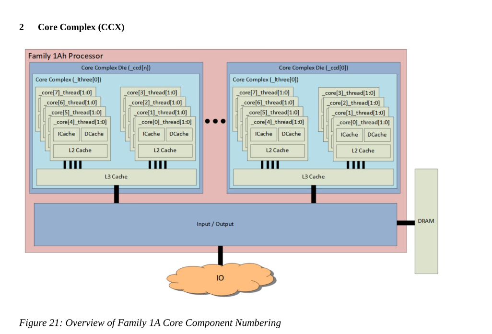

# Random notes

Random notes I'm taking.

## Processor Programming Reference

Notes from *Processor Programming Reference (PPR) for AMD Family 1Ah Model 44h*.
Here's a nice diagram of a Core Complex (CCX):




A Core Complex is defined as being where: "Core Complex where more than one core shares L3 resources."
My Zen5 CPU apparently has two core complexes:
```
$ cat /sys/devices/system/cpu/cpu0/cache/index3/shared_cpu_list
0-5,12-17
```
This is an L3 cache:
```
$ cat /sys/devices/system/cpu/cpu0/cache/index3/level
3
```
And is also unified:
```
$ cat /sys/devices/system/cpu/cpu0/cache/index3/type
Unified
```

The L2 cache is also unified, but the L1 cached has separate L1d and L1i caches.
